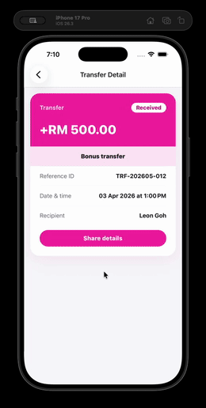
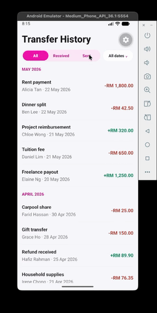
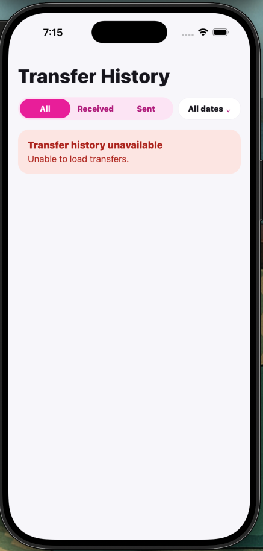
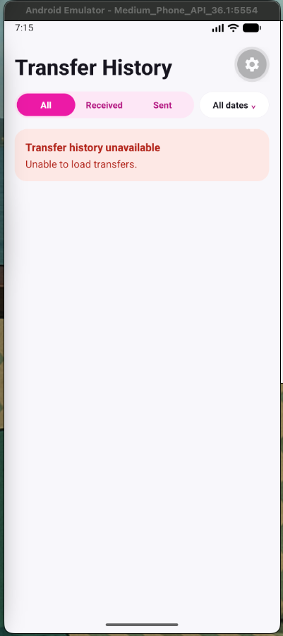
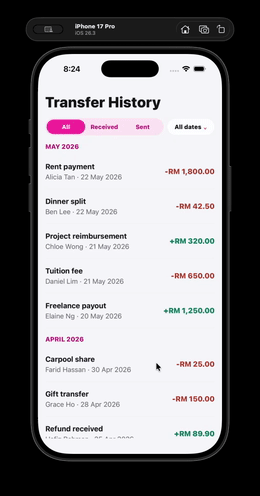
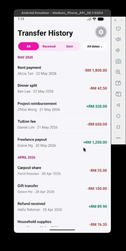

# Transfer History Mobile

A React Native transfer history module built with Expo and TypeScript. The app focuses on a clean transfer list, grouped history, filters, paginated loading, transfer detail review, and native sharing.

## Tech Stack

| Area             | Choice                                                |
| ---------------- | ----------------------------------------------------- |
| Runtime          | Expo SDK 56, React Native 0.85                        |
| Language         | TypeScript                                            |
| Navigation       | React Navigation native stack                         |
| State management | Zustand                                               |
| Testing          | Jest, jest-expo, React Native Testing Library         |
| Quality          | ESLint, Prettier formatting, TypeScript type checking |

## Contents

- [Setup](#setup)
- [Run the App](#run-the-app)
- [Screenshots and Demos](#screenshots-and-demos)
- [Verify](#verify)
- [Verified With](#verified-with)
- [What Is Included](#what-is-included)
- [Architecture Decisions](#architecture-decisions)
- [Project Structure](#project-structure)
- [Error and Empty States](#error-and-empty-states)
- [Test Coverage](#test-coverage)
- [Notes](#notes)

## Setup

Install dependencies:

```sh
npm install
```

The project uses the Expo CLI through the local `expo` package, so no global Expo installation is required.

## Run the App

Start Metro:

```sh
npm start
```

From the Expo terminal UI:

- Press `i` to open iOS Simulator.
- Press `a` to open Android Emulator.
- Scan the QR code with Expo Go to run on a physical device on the same network.

Expo Go is sufficient for this project because it does not require custom native modules or committed native iOS/Android folders.

Direct commands are also available:

```sh
npm run ios
npm run android
```

Use a native device build only if you specifically want to test a generated native project:

```sh
npx expo run:ios --device
npx expo run:android --device
```

## Screenshots and Demos

### Transfer History

| iOS                                                                                  | Android                                                                                      |
| ------------------------------------------------------------------------------------ | -------------------------------------------------------------------------------------------- |
|  |  |

### Load Error State

| Scenario           | iOS                                                                                         | Android                                                                                             |
| ------------------ | ------------------------------------------------------------------------------------------- | --------------------------------------------------------------------------------------------------- |
| Initial load error |      |      |
| Load-more retry    |  |  |

## Verify

Run the automated test suite:

```sh
npm test -- --runInBand
```

Run static checks:

```sh
npm run typecheck
npm run lint
npm run format:check
```

## Verified With

The current implementation was verified in this workspace with the following versions. These are not the only supported versions.

| Tool         | Version |
| ------------ | ------- |
| Node.js      | v25.2.1 |
| Expo         | ~56.0.3 |
| React Native | 0.85.3  |
| React        | 19.2.3  |

React Native 0.85 supports Node versions matching `^20.19.4 || ^22.13.0 || ^24.3.0 || >=25.0.0`.

## What Is Included

| Area             | Implementation                                                                                              |
| ---------------- | ----------------------------------------------------------------------------------------------------------- |
| Transfer data    | Local JSON data with 30 sample transfers                                                                    |
| Data safety      | Lightweight runtime validation before data reaches the UI                                                   |
| Transfer history | Sectioned list grouped by month                                                                             |
| Filtering        | All, Received, Sent filters plus compact date-range filter                                                  |
| Pagination       | Real client pagination backed by a simulated paginated service using `offset` and `count`                   |
| Refresh          | Pull-to-refresh reloads the first page                                                                      |
| Loading state    | Shared skeleton component for first load                                                                    |
| State management | Zustand manages transfers, filters, loading, refresh, pagination, and errors                                |
| Detail screen    | Shows amount, reference ID, date and time, recipient, and transfer name                                     |
| Sharing          | Native share sheet exports transfer detail text                                                             |
| Empty states     | Shows an empty state when no rows are available for the current data and filters                            |
| Error states     | Handles first load, refresh, load more, malformed JSON, and missing detail states                           |
| Tests            | Unit tests for formatting, filtering, sectioning, validation, pagination, store behavior, and screen render |

## Architecture Decisions

| Decision                      | Reason                                                                                                                    |
| ----------------------------- | ------------------------------------------------------------------------------------------------------------------------- |
| Expo                          | Keeps local development fast while preserving native iOS and Android run targets.                                         |
| React Navigation              | Provides a typed native-stack flow for history and detail screens.                                                        |
| Zustand                       | Keeps cross-screen transfer state simple, especially detail lookup from already-loaded list data.                         |
| SectionList                   | Fits grouped transfer history and supports larger lists better than manually rendering sections.                          |
| Mock service boundary         | The screen does not read JSON directly; data access stays behind a service contract.                                      |
| Client-owned pagination state | The mock service only returns the requested slice. The store owns `nextOffset` and whether more data should be requested. |
| Runtime JSON validation       | TypeScript protects code at compile time, while validation protects the app from malformed local JSON at runtime.         |
| Shared tokens                 | Color, spacing, radius, and font sizes live in one theme file to keep UI changes consistent.                              |

## Project Structure

```text
src
├── modules
│   └── transferHistory
│       ├── components
│       ├── navigation
│       ├── screens
│       ├── services
│       ├── store
│       ├── test
│       ├── types
│       └── utils
├── navigation
└── shared
    ├── components
    └── theme
```

Key files:

- `src/modules/transferHistory/screens/TransferHistoryScreen.tsx` renders the main transfer list, filters, refresh, and pagination footer.
- `src/modules/transferHistory/screens/TransferDetailScreen.tsx` renders detail and native share behavior.
- `src/modules/transferHistory/store/useTransferHistoryStore.ts` owns transfer loading, refresh, load-more, filters, and UI state.
- `src/modules/transferHistory/services/mockTransferService.ts` simulates an API boundary over local JSON.
- `src/modules/transferHistory/utils/validateTransferResponse.ts` validates JSON shape at runtime.
- `src/shared/theme/tokens.ts` centralizes shared design tokens.

## Error and Empty States

- First load shows skeleton rows.
- Malformed JSON or load failure shows a user-facing history error.
- Pull-to-refresh failure uses the same history error area without blocking existing loaded rows.
- Load-more failure shows a footer message with a compact retry button.
- Empty transfer data shows `No transfers found.`
- Detail screen shows a missing-state panel if the selected transfer is not in the loaded store.

## Test Coverage

The test suite covers:

- Transfer response validation.
- Amount and share text formatting.
- Transfer filtering.
- Month section creation.
- Pagination state calculation.
- Zustand loading and pagination behavior.
- Transfer history screen render path.

Run:

```sh
npm test -- --runInBand
```

## Notes

- The app uses mock JSON data only; there is no real API integration.
- The mock service intentionally simulates latency so loading, refresh, and pagination states are visible.
- The mock service does not return a total count. The store treats a full page as a signal that another page may exist, which keeps the mock closer to simple offset pagination without extra metadata.
- Sorting is newest first before pagination.
